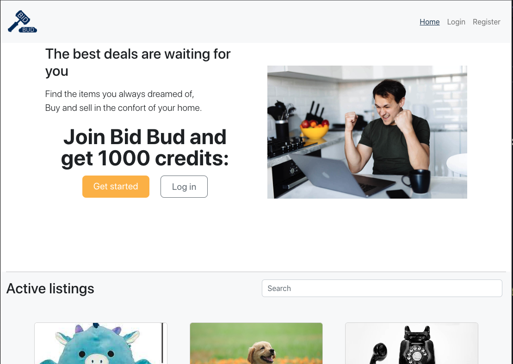

## BIDBUD -  Semester Project 2  :hammer:

## Project Description :star:

This is the Semester project 2 for the Front-End Development course at Noroff. 




## Briefing :memo:
An auction site is looking to launch a website where users can add items to be bid on and bid on items other users have put up for auction.

When a user joins the website, they are given 1000 credits to use on the site. They can get credits by selling items and use credit by buying items. Non-registered users can search through the listings.


## User stories:

- :heavy_check_mark: A user with a stud.noroff.no email may register
- :heavy_check_mark: A registered user may log in
- :heavy_check_mark: A registered user may logout
- :heavy_check_mark: A registered user may update their avatar
- :heavy_check_mark: A registered user may view their total credit
- :heavy_check_mark: A registered user may create a Listing with a title, deadline date, media gallery and description
- :heavy_check_mark: A registered user may add a Bid to another user’s Listing
- :heavy_check_mark: A registered user may view Bids made on a Listing
- :heavy_check_mark: An unregistered user may search through Listings


## Links

- [Gantt Chart](https://github.com/users/Emilyrf/projects/1/views/2)
- [Design Prototype](https://xd.adobe.com/view/8464beca-3e48-4cc3-a9a0-fd4dfd4b1c14-d137/)
- [Style Guide](https://xd.adobe.com/view/b2e3c53a-fdd4-43c2-a22f-1d70dcee839a-e7b0/)
- [Kanban Board ](https://github.com/users/Emilyrf/projects/1/views/1)
- [Repository ](https://github.com/Emilyrf/semester-project-2-emilyrf)
- [Hosted Demo ](https://loquacious-yeot-03cf33.netlify.app)

  
## Built With :wrench:

- [HTML](https://developer.mozilla.org/en-US/docs/Web/HTML)
- [JavaScript](https://developer.mozilla.org/en-US/docs/Web/JavaScript)
- [SASS]
- [Bootstrap](https://blog.getbootstrap.com)

- [Noroff API](https://docs.noroff.dev)

## Deployed with Netlify :globe_with_meridians:

[link](https://loquacious-yeot-03cf33.netlify.app)


## Getting Started :hammer_and_wrench:

### Installing , Running and Testing

1. Clone the repo:
```bash
gh repo clone Emilyrf/semester-project-2-emilyrf
```

2. Install the dependencies:
```bash
npm i
```

3. Build:
```bash
npm run build
```

4. Run the app:
```bash
npm run start
```


